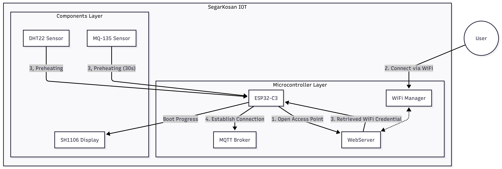

# SegarKosan: Smart Kosan with Odor Detection

[](https://platformio.org/)
[](https://www.arduino.cc/)

> **Real-time indoor air quality monitoring system for student boarding rooms (kos-kosan) using ESP32-C3 microcontroller.**

## Table of Contents

- [Overview](#overview)
- [Features](#features)
- [Hardware Components](#hardware-components)
- [System Architecture](#system-architecture)
- [Getting Started](#getting-started)
  - [Prerequisites](#prerequisites)
  - [Hardware Setup](#hardware-setup)
  - [Software Installation](#software-installation)
  - [Configuration](#configuration)
- [API Documentation](#api-documentation)
- [Usage](#usage)
- [Data Flow](#data-flow)
- [Odor Score Calculation](#odor-score-calculation)
- [Alert System](#alert-system)
- [Roadmap](#roadmap)
- [Contributing](#contributing)
- [License](#license)

## Overview

**SegarKosan** is an IoT-based air quality monitoring system designed specifically for student boarding rooms (kos-kosan). The system continuously monitors air quality parameters and provides real-time feedback through a web dashboard.

The device measures:
- **Temperature** (Celsius)
- **Humidity** (%)
- **Air Quality/CO2 levels** (ppm)
- **Odor Score** (0-100 scale)

All data is transmitted via MQTT/HTTP to a local backend server, stored in MongoDB, and visualized in real-time on a web dashboard with historical graphs and alert notifications.

## Features

- **Real-time Monitoring**: Continuous temperature, humidity, and air quality tracking
- **Odor Score**: Proprietary algorithm converting sensor data to a 0-100 odor score
- **24-Hour Graphs**: Historical data visualization
- **Smart Alerts**: Notifications for critical odor levels or high humidity
- **Dual Communication**: MQTT and HTTP REST API support
- **Web Dashboard**: Real-time gauges and metrics display
- **OLED Display**: Local display using SH1106 screen
- **mDNS Support**: Easy device discovery on local network
- **Serial Control**: USB serial commands for WiFi reconnect and device reboot
- **Low Power**: Optimized for continuous operation

## Hardware Components

| Component | Model | Purpose |
|-----------|-------|---------|
| Microcontroller | ESP32-C3 DevKitC-02 | Main processing unit with WiFi |
| Temperature/Humidity Sensor | DHT22 (AM2302) | Environmental monitoring |
| Gas Sensor | MQ-135 | Air quality and CO2 detection |
| Display | SH1106 OLED (128x64) | Local status display |
| Power Supply | USB-C 5V | Device power |

### Pin Configuration

```
DHT22:
  - VCC  -> 3.3V
  - DATA -> GPIO 4
  - GND  -> GND

MQ-135:
  - VCC  -> 5V
  - AO   -> A0 (GPIO 0)
  - GND  -> GND

SH1106 OLED (I2C):
  - VCC  -> 3.3V
  - GND  -> GND
  - SCL  -> GPIO 9 (Default I2C SCL)
  - SDA  -> GPIO 8 (Default I2C SDA)
```

## System Architecture


## Getting Started

### Prerequisites

- **PlatformIO IDE** (VS Code extension recommended)
- **Python 3.7+** (for PlatformIO)
- **Git** (for version control)
- USB cable (USB-C for ESP32-C3)
- WiFi network (2.4GHz)

### Hardware Setup

1. **Assemble the circuit** following the pin configuration above
2. **Connect sensors** to the ESP32-C3 development board
3. **Attach OLED display** via I2C interface
4. **Verify connections** before powering on

> ⚠️ **Important**: MQ-135 requires 5V power supply. Connect to VIN/5V pin, not 3.3V.

### Software Installation

#### Option 1: Using PlatformIO VSCode Extension (Recommended)

1. **Install Visual Studio Code**:
   - Download from [code.visualstudio.com](https://code.visualstudio.com/)
   - Install and launch VS Code

2. **Install PlatformIO IDE Extension**:
   - Open VS Code
   - Click the Extensions icon (Ctrl+Shift+X / Cmd+Shift+X)
   - Search for "PlatformIO IDE"
   - Click **Install** on the official extension by PlatformIO
   - Wait for installation to complete (may take a few minutes)
   - Restart VS Code if prompted

3. **Clone the repository**:
   ```bash
   git clone https://github.com/yourusername/SegarKosan.git
   cd SegarKosan
   ```

4. **Open project in VS Code**:
   - **File** -> **Open Folder**
   - Select the `SegarKosan` folder
   - PlatformIO will automatically detect the project

5. **Install dependencies** (automatic):
   - PlatformIO will automatically install all libraries listed in `platformio.ini`
   - Wait for the status bar to show "PlatformIO: Ready"
   - Check the terminal output for installation progress

6. **Using PlatformIO Toolbar**:
   
   The PlatformIO toolbar appears at the bottom of VS Code:
   
   - **Home** - Open PlatformIO Home
   - **Build** - Compile the project (Ctrl+Alt+B)
   - **Upload** - Upload firmware to device (Ctrl+Alt+U)
   - **Clean** - Clean build files
   - **Serial Monitor** - Open serial monitor (Ctrl+Alt+S)
   - **Test** - Run unit tests

6. **Configure secrets** (First time only):
   ```bash
   cp secret.ini.example secret.ini
   # Edit secret.ini with your WiFi credentials and server settings
   ```

7. **Build the project**:
   - Click the **Build** icon in the PlatformIO toolbar
   - Or press `Ctrl+Alt+B` (Windows/Linux) / `Cmd+Alt+B` (Mac)
   - Or open Command Palette (F1) -> type "PlatformIO: Build"
   - Wait for compilation to complete

8. **Connect ESP32-C3**:
   - Connect your ESP32-C3 board via USB-C cable
   - The device should be automatically detected
   - Check the bottom status bar for the detected port (e.g., `/dev/ttyUSB0` or `COM3`)

9. **Upload firmware**:
   - Click the **Upload** icon in the PlatformIO toolbar
   - Or press `Ctrl+Alt+U` (Windows/Linux) / `Cmd+Alt+U` (Mac)
   - PlatformIO will automatically:
     - Build the project if needed
     - Detect the upload port
     - Flash the firmware to ESP32-C3

10. **Monitor serial output**:
    - Click the **Serial Monitor** icon in the PlatformIO toolbar
    - Or press `Ctrl+Alt+S` (Windows/Linux) / `Cmd+Alt+S` (Mac)
    - Set baud rate to **115200** (configured in this project)
    - Watch for WiFi connection status and sensor readings

#### Option 2: Using PlatformIO CLI

1. **Install PlatformIO Core**:
   ```bash
   # Using pip
   pip install -U platformio
   
   # Or using installer script
   curl -fsSL https://raw.githubusercontent.com/platformio/platformio-core-installer/master/get-platformio.py -o get-platformio.py
   python3 get-platformio.py
   ```

2. **Clone the repository**:
   ```bash
   git clone https://github.com/yourusername/SegarKosan.git
   cd SegarKosan
   ```

3. **Configure secrets**:
   ```bash
   cp secret.ini.example secret.ini
   # Edit secret.ini with your credentials
   ```

4. **Install dependencies**:
   ```bash
   pio pkg install
   # Dependencies are automatically installed from platformio.ini
   ```

4. **Build the project**:
   ```bash
   pio run
   # Or specify environment
   pio run -e SegarKosan
   ```

5. **Upload to ESP32-C3**:
   ```bash
   pio run --target upload
   # Or with specific port
   pio run --target upload --upload-port /dev/ttyUSB0
   ```

6. **Monitor serial output**:
   ```bash
   pio device monitor
   # Or with specific baud rate
   pio device monitor --baud 115200
   ```

7. **Build + Upload + Monitor (all in one)**:
   ```bash
   pio run --target upload && pio device monitor
   ```

#### PlatformIO Project Structure

Once opened in VS Code with PlatformIO:

```
SegarKosan/
├── .pio/                   # PlatformIO build files (auto-generated)
├── .vscode/                # VS Code settings (auto-generated)
├── include/                # Header files (.h)
│   ├── DHT22.h
│   ├── esp32c3.h
│   ├── MQ135.h
│   └── SSH1106.h
├── lib/                    # Private libraries
├── src/                    # Source files (.cpp)
│   └── Main.cpp           # Main application code
├── test/                   # Unit tests
├── platformio.ini          # PlatformIO configuration
├── secret.ini.example      # Template for credentials (commit this)
├── secret.ini              # Your actual credentials (DO NOT commit)
├── .gitignore              # Git ignore file (includes secret.ini)
└── README.MD               # This file
```

#### Troubleshooting PlatformIO

**Problem: Port not detected**
```bash
# List all available ports
pio device list

# Specify port manually
pio run --target upload --upload-port /dev/ttyUSB0  # Linux
pio run --target upload --upload-port COM3          # Windows
```

**Problem: Permission denied on Linux**
```bash
# Add your user to dialout group
sudo usermod -a -G dialout $USER
# Log out and log back in for changes to take effect
```

**Problem: ESP32-C3 not entering bootloader mode**
- Hold the **BOOT** button while clicking **RESET**
- Release **RESET**, then release **BOOT**
- Try upload again

**Problem: Dependencies not installing**
```bash
# Clean and reinstall
pio pkg install --force
# Or manually
pio lib install "adafruit/Adafruit SH110X@^2.1.14"
```

**Problem: Build errors**
```bash
# Clean build files
pio run --target clean
# Rebuild
pio run
```

### Configuration

**Important**: Never commit sensitive credentials to Git!

1. **Copy the example configuration**:
   ```bash
   cp secret.ini.example secret.ini
   ```

2. **Edit `secret.ini` with your actual credentials**:
   ```ini
   [secret]
   wifi_ssid = YourWiFiSSID
   wifi_password = YourWiFiPassword
   websocket_server = 192.168.1.100
   websocket_port = 8080
   ```

3. **Verify `secret.ini` is in `.gitignore`** (already configured)

4. **Build and upload**:
   - PlatformIO will automatically inject these values as build flags
   - The firmware will use these credentials at runtime
   - No source code changes needed

**How it works**:
- `platformio.ini` loads `secret.ini` via `extra_configs`
- Values are injected as preprocessor macros (`WIFI_SSID`, `WIFI_PASSWORD`, etc.)
- `src/Main.cpp` uses these macros instead of hardcoded strings
- `secret.ini` is ignored by Git to protect your credentials

## API Documentation

For detailed API documentation, see [API.md](API.md).

### Quick Reference

**Get Current Sensor Data**:
```bash
curl http://smart-kosan-odor-detection.local/state
```

**Response**:
```json
{
  "temperature": 28.5,
  "humidity": 65.2,
  "heatIndex": 30.1,
  "co2": 450,
  "odorScore": 42,
  "timestamp": 1729584000
}
```

## Usage

### First Boot

1. **Power on the device**
2. **Check serial monitor** for WiFi connection status
3. **Note the IP address** or use mDNS: `SegarKosan.local`
4. **Access web dashboard** at the displayed URL
5. **Verify sensor readings** on OLED display

### Normal Operation

- Device automatically connects to WiFi on boot
- Sensor readings update every 2-5 seconds
- Data is published to MQTT broker automatically
- OLED display shows current readings
- Web API available for manual queries

### Monitoring

- **Serial Monitor**: Real-time debug information
- **OLED Display**: Local sensor readings
- **Web Dashboard**: Comprehensive data visualization
- **MQTT**: Subscribe to topic for real-time data stream

### Serial Commands

Open the Serial Monitor and set baud rate to 9600 (as configured in `setup()`). Supported commands (type and press Enter):

- `reconnect` or `wifi reconnect` - Reconnect WiFi using the last configuration passed to `Net::begin()`.
- `reboot`, `restart`, or `reset` - Reboot the ESP32-C3.
- `help` - Show available commands.

The device prints acknowledgements prefixed with `[CMD]`, e.g. `[CMD] Reconnect result: OK`.

## Data Flow

1. **Sensor Reading**: DHT22 and MQ-135 sensors are read every 2-5 seconds
2. **Data Processing**: Raw values are converted to standard units (Celsius, %, ppm)
3. **Odor Score Calculation**: Algorithm processes all parameters into 0-100 score
4. **Local Display**: Current values shown on SH1106 OLED
5. **Network Transmission**: Data sent via MQTT and/or HTTP POST
6. **Backend Storage**: MongoDB stores timestamped records
7. **Dashboard Update**: WebSocket/SSE pushes updates to web clients
8. **Alert Evaluation**: Backend checks thresholds and triggers notifications

## Odor Score Calculation

The Odor Score (0-100) is calculated based on:

- **CO2 levels** (40% weight)
- **Temperature deviation** from comfort zone (20% weight)
- **Humidity levels** (20% weight)
- **Air quality sensor** raw values (20% weight)

**Score Interpretation**:
- **0-30**: Fresh air, excellent quality
- **31-50**: Good air quality, comfortable
- **51-70**: Moderate, consider ventilation
- **71-90**: Poor quality, ventilation needed
- **91-100**: Critical, immediate action required

## Alert System

Alerts are triggered when:

- **Odor Score >= 75**: Critical odor level
- **Humidity >= 80%**: High humidity warning
- **Temperature >= 35 C**: Excessive heat warning
- **CO2 >= 1000 ppm**: Ventilation required

Alert notifications are sent via:
- Web dashboard notifications
- MQTT alert topic
- Email (optional, backend feature)

## Roadmap

See [ROADMAP.md](ROADMAP.md) for the detailed development plan and progress.

## Contributing

Contributions are welcome! Please follow these steps:

1. Fork the repository
2. Create a feature branch (`git checkout -b feature/AmazingFeature`)
3. Commit your changes (`git commit -m 'Add some AmazingFeature'`)
4. Push to the branch (`git push origin feature/AmazingFeature`)
5. Open a Pull Request

## License

This project is licensed under the MIT License - see the [LICENSE](LICENSE) file for details.

## Acknowledgments

- **Adafruit** for excellent sensor libraries
- **PlatformIO** for the amazing development platform
- **ESP32 Community** for extensive documentation and support

## Licensing

© 2025 SegarKosan by Morning Group. All rights reserved.